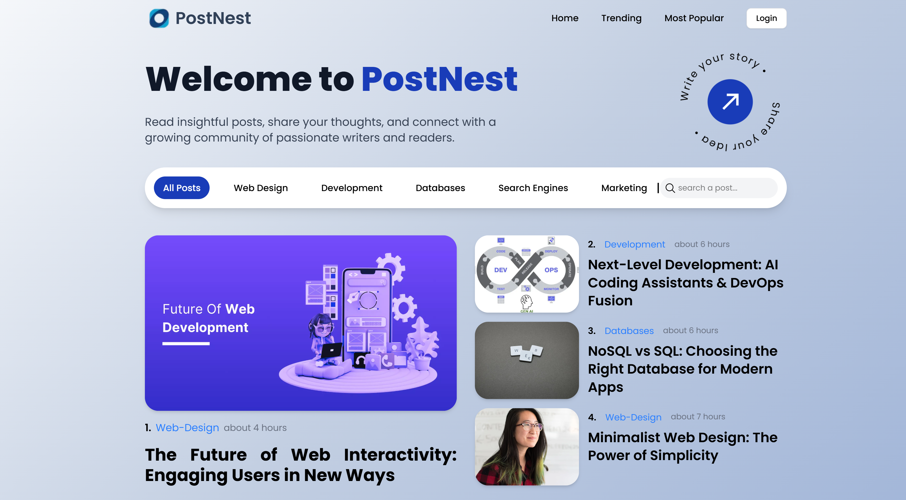
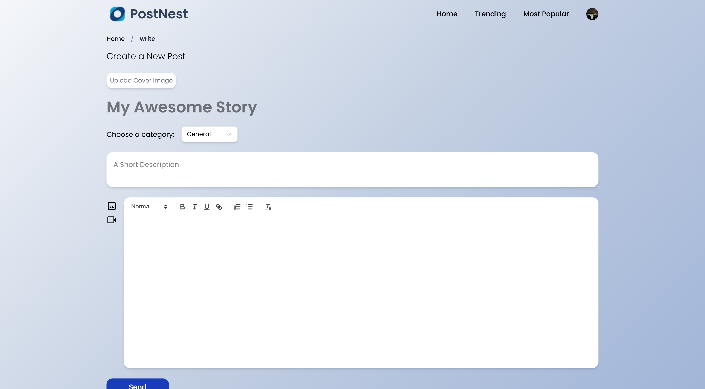
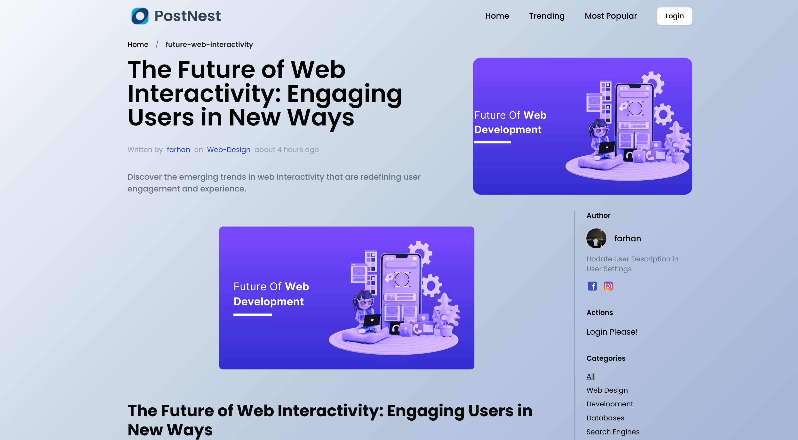
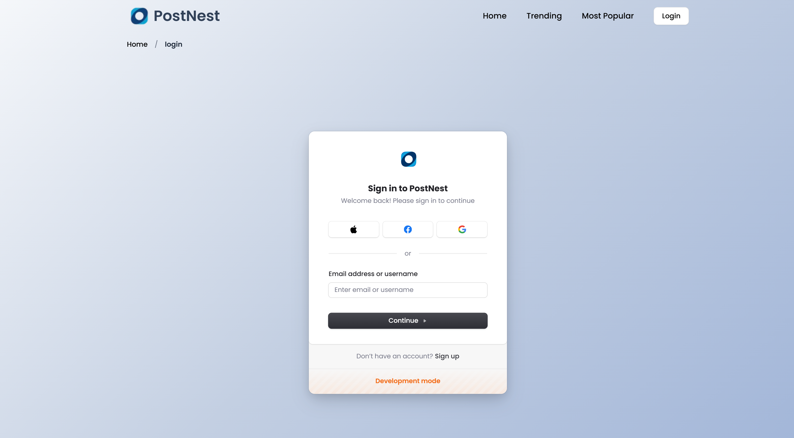
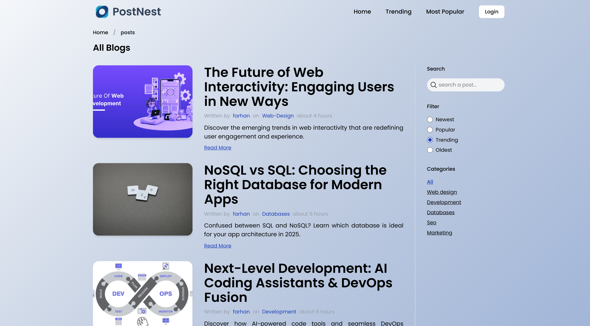

# 📝 Postnest – A Modern Full-Stack Blogging Platform

Postnest is a sleek, full-featured blogging platform built with the modern web stack. It supports secure authentication, rich post creation, real-time interactions, and seamless browsing—all in a responsive, mobile-friendly UI.

🚀 **Live Demo**: [https://postnest.vercel.app](https://postnest.vercel.app)  
📦 **Repository**: [github.com/TheRealFarhanDev/postnest](https://github.com/TheRealFarhanDev/postnest)


---

## 🔧 Tech Stack

| Frontend | Backend | Hosting | Misc |
|----------|---------|---------|------|
| React + Vite ⚛️ | Node.js + Express.js 🌐 | Vercel (Frontend) ▲ | Clerk (Auth) 🔐 |
| Tailwind CSS 🎨 | MongoDB Atlas 🍃 | Render (Backend) 🚀 | UptimeRobot (Monitoring) 📈 |
| ShadCN UI 🧩 |                       |                         | React-Quill (Rich Text) 📝 |

---

## 🌟 Features

- 🔐 **Authentication** – Sign up, login, logout via [Clerk.dev](https://clerk.dev)
- 📝 **Rich Blog Editor** – Create & edit blogs using **React-Quill**
- 📚 **Breadcrumb Navigation** – Easy-to-follow structure
- 🔍 **Search + Filters** – Filter by tags, categories, or search terms
- 📈 **Trending Posts** – Highlights popular posts based on page visits
- 🧮 **Visit Counter** – Tracks unique post views
- 🔐 **Protected Routes** – Only logged-in users can create or edit posts
- 📱 **Fully Responsive** – Optimized across all devices
- 📄 **Pagination** – Easily browse through multiple posts

---

## 🛠️ Setup Instructions

### 🔁 Clone the Repository

```bash
git clone https://github.com/TheRealFarhanDev/postnest.git
cd postnest
```

---

### ⚙️ Frontend Setup

```bash
cd client
npm install
npm run dev
```

#### 📄 `.env` Example (Frontend)

```env
VITE_CLERK_PUBLISHABLE_KEY=your_clerk_publishable_key
VITE_CLERK_FRONTEND_API=your_clerk_frontend_api
VITE_API_URL=https://postnest-zsmf.onrender.com
```

---

### ⚙️ Backend Setup

```bash
cd server
npm install
npm run dev
```

#### 📄 `.env` Example (Backend)

```env
PORT=3000
MONGODB_URI=your_mongodb_atlas_uri
CLERK_SECRET_KEY=your_clerk_secret_key
CLERK_WEBHOOK_SECRET=your_clerk_webhook_secret
```

---

## 🌐 Hosting Details

- **Frontend**: Hosted on **Vercel** for blazing-fast static delivery.
- **Backend**: Hosted on **Render**, auto-sleep enabled.
- **Monitoring**: **UptimeRobot** used to keep backend alive via `/ping` route.

---

## 🧠 Learnings

- Integrated **Clerk** for full-stack auth (frontend & backend middleware)
- Gained experience with **rich text editors** and content sanitization
- Built responsive UI with **ShadCN** and **Tailwind CSS**
- Designed and optimized **RESTful APIs** using Express + Mongoose
- Implemented real-time **visit counters** and post-trend logic
- Deployed production-ready frontend + backend with environmental separation

---

## 📸 Screenshots & Demo

### 🏠 Home Page


### ✍️ Create Post


### 📄 Post Detail View


### 🔐 Login Screen


### 📊 Dashboard


---


Made with ❤️ by [@TheRealFarhanDev](https://github.com/TheRealFarhanDev)
